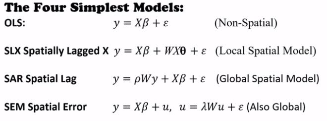

<style>
h1.title {font-size: 18pt; color: DarkBlue;} 
body, h1, h2, h3, h4 {font-family: "Palatino", serif;}
body {font-size: 12pt;}
/* Headers */
h1,h2,h3,h4,h5,h6{font-size: 14pt; color: #00008B;}
body {color: #333333;}
a, a:hover {color: #8B3A62;}
pre {font-size: 12px;}
</style>

Suggested citation: 

> Mendez C. (2020).  Spatial regression analysis in R. R Studio/RPubs. Available at <https://rpubs.com/quarcs-lab/tutorial-spatial-regression>

This work is licensed under the Creative Commons Attribution-Non Commercial-Share Alike 4.0 International License. 


Acknowledgment:

Material adapted from multiple sources, in particular [BurkeyAcademy's GIS & Spatial Econometrics Project](https://spatial.burkeyacademy.com/)

# Libraries

```{r message=FALSE, warning=FALSE}
knitr::opts_chunk$set(echo = TRUE)

library(tidyverse)  # Modern data science workflow
library(spdep)
library(spatialreg)
library(sf)
library(rgdal)
library(rgeos)


# Change the presentation of decimal numbers to 4 and avoid scientific notation
options(prompt="R> ", digits=4, scipen=7)
```

# Tutorial objectives

- Import shapefiles into R

- Import neighbor relationship from `.gal` files

- Create neighbor relationships in R from shape files

- Create neighbor relationships in R from shape latitude and longitude

- Understand the difference between Great Circle and Euclidean distances

- Export neighbor relationships as weight matrices to plain text files

- Test for spatial dependence via the Moran's I test

- Evaluate the four simplest models of spatial regression


# Replication files

- All necessary files can be downloaded from  [BurkeyAcademy's GIS & Spatial Econometrics Project](https://spatial.burkeyacademy.com/)

- If you are a member of the [QuaRCS lab](https://quarcs-lab.rbind.io/), you can run this tutorial in [R Studio Cloud](https://rstudio.cloud/spaces/15597/project/965714) and access the files in the following [Github Repository](https://github.com/quarcs-lab/tutorial-spatial-regression)

# Preliminary material

- [Overview of Spatial Econometric Models](https://youtu.be/6qZgchGCMds)

- [Recall of spatial regression in GeoDa and its limitations](https://youtu.be/2IIXH5h6Gz0)

- [R Spatial Data 1: Import shapefiles, create weights matrices, and run Moran's I](https://youtu.be/_bnorgXbSG4)

- [R Spatial Data 2: Make KNN from Lon/Lat text file and export as matrix](https://youtu.be/MtkuQxxQj5s)

- [R Spatial Regression 1: The Four Simplest Models](https://youtu.be/b3HtV2Mhmvk)

- [R Spatial Regression 2: All of the models, likelihood Ratio specification tests, and spatial Breusch-Pagan](https://youtu.be/MbQ4s8lwqGI)

# Import spatial data

Let us use  the `readOGR` function from the `rgdal` library to import the `.shp` file

```{r}
#NCVACO <- readOGR(dsn = ".", layer = "data/NCVACO.shp")
NCVACO <- st_read("data/NCVACO.shp")
```

Note that the file is imported as a `SpatialPolygonsDataFrame` object


# Import neighbor relationship: `.gal` file

Let us use  the `read.gal` function from the `rgdal` library to import the `.gal` weights matrix created in GeoDa

```{r}
queen.nb <- read.gal("data/NCVACO-Wqueen.gal", region.id=NCVACO$FIPS)
```

## Summarize neighbor relationships

```{r}
summary(queen.nb)
```

- Is the is the neighbor relationship symmetric?

```{r}
is.symmetric.nb(queen.nb)
```


# Create is the neighbor relationship in R


## From a shapefile

- For queen contiguity

```{r}
queen.R.nb <- poly2nb(NCVACO, row.names = NCVACO$FIPS)
```

- Alternatively, you can create a Rook contiguity relationship as 

```{r}
rook.R.nb <- poly2nb(NCVACO, row.names = NCVACO$FIPS, queen=FALSE)
```

### Summarize neighbor relationships

```{r}
summary(queen.R.nb)
```

- Are the relationships symmetric?

```{r}
is.symmetric.nb(queen.R.nb)
```


## From latitude and longitude

- Import table

```{r}
nc.cent <- read.csv(file="data/CenPop2010_Mean_CO37.txt")
```

- Identify coordinates

```{r}
nc.coords <- cbind(nc.cent$LONGITUDE, nc.cent$LATITUDE)
```


### Identify 5 nearest neighbors 


#### The right way

Recognize that latitude and longitude are handled using **great circle distances**

```{r}
nc.5nn <- knearneigh(nc.coords, k=5, longlat = TRUE)
```


#### The wrong way


Fail to recognize that latitude and longitude are handled using great circle distances. Latitude and longitude should not be used to compute **Euclidean distances**

```{r}
nc.5nn.wrong <- knearneigh(nc.coords, k=5, longlat = FALSE)
```


### Create 5 nearest neighbors relationship


```{r}
nc.5nn.nb <- knn2nb(nc.5nn)
```


Plot the right neighbor relationship

```{r}
plot(nc.5nn.nb, nc.coords)
```


```{r}
nc.5nn.nb.wrong <- knn2nb(nc.5nn.wrong)
```


Plot the wrong neighbor relationship


```{r}
plot(nc.5nn.nb.wrong, nc.coords)
```


Compare the differences

```{r}
plot(nc.5nn.nb,nc.coords)
plot(diffnb(nc.5nn.nb, nc.5nn.nb.wrong), nc.coords, add=TRUE, col="red", lty=2)
title(main="Differences between Euclidean and Great Circle k=5 neighbors")
```


## Compare neighbor relationships

- Do the two queen-based neighbor relationships have the same  structure?

```{r}
isTRUE(all.equal(queen.nb, queen.R.nb, check.attributes=FALSE))
```

- Do the two 5nn relationships have the same  structure?


```{r}
isTRUE(all.equal(nc.5nn.nb, nc.5nn.nb.wrong, check.attributes=FALSE))
```

## Export as plain text weight matrices


```{r}
nc.5nn.mat <- nb2mat(nc.5nn.nb)
```


```{r}
write.csv(nc.5nn.mat, file="data/nck5.csv")
```


## Note on storing and converting neighbor relationships

There are many ways to store weights matrices and contiguity files:

- `listw` is used in most spdep commands

- `nb` means neighbor file

- `knn` is  a k nearest neighbors object

- `neigh` is another kind of neighbor file,  common in ecology (e.g. package ade4)

- `poly` stores it a "polygons" of a map file


There are many commands to convert one way of storing contiguity information into another:

- `poly2nb(object)`   converts `polygon` to `nb`

- `nb2listw(object)`   converts `nb` to `listw`


# Test spatial autocorrelation

Let us use the Moran's I based on the function `moran`, which need the following arguments:

- variable

- neighbor relationship as a `listw` object

- number of regions

- sum of weights

```{r}
moranStatistic <- moran(NCVACO$SALESPC, nb2listw(queen.nb), length(NCVACO$SALESPC), Szero(nb2listw(queen.nb)))
moranStatistic
```

Moran statistic 

```{r}
moranStatistic[["I"]]
```

An alternative way of computing the test and a p value

```{r}
moranTest <- moran.test(NCVACO$SALESPC, nb2listw(queen.nb))
moranTest
```

Moran Statistic

```{r}
moranTest[["estimate"]][["Moran I statistic"]]
```


P-value

```{r}
moranTest[["p.value"]]
```

# Regression models


## Import spatial data

```{r}
#spat.data = readOGR(dsn = ".", layer = "NCVACO")
spat.data <- st_read("data/NCVACO.shp")
```

- show variable names

```{r}
names(spat.data) 
```


This dataset is some data from some studies Mark Burkey did on liquor demand using data from around 2003. In particular, he looks at the states of Virginia and North Carolina. This dataset is related to, but not the same as data used on an NIH grant and published in a paper: 

 > [Burkey, Mark L. Geographic Access and Demand in the Market for Alcohol. The Review of Regional Studies, 40(2), Fall 2010, 159-179](https://ideas.repec.org/p/pra/mprapa/36913.html)  

Unit of analysis: counties in Virginia and North Carolina 

Variable Descriptions:


- `Lon Lat`   Longitude and Latitude of County Centroid

- `FIPS`  FIPS Code for County (Federal Information Processing Standard)

- `qtystores`  #Liquor Stores in County

- `SALESPC`  Liquor Sales per capita per year, $

- `PCI`  Per capita income

- `COMM15OVP`  % commuting over 15 minutes to work

- `COLLENRP`  % of people currently enrolled in college

- `SOMECOLLP` % of people with "some college" or higher education level

- `ARMEDP` % in armed forces

- `NONWHITEP` % nonwhite

- `UNEMPP` % unemployed

- `ENTRECP` % employed i entertainment or recreation fields (proxy for tourism areas)

- `PUBASSTP` % on public assistance of some sort

- `POVPOPP` % in poverty

- `URBANP` % living in urban areas

- `FOREIGNBP` % foreign born

- `BAPTISTSP` % southern baptist (historically anti-alcohol)

- `ADHERENTSP` % adherents of any religion

- `BKGRTOMIX` wtd. average distance from block group to nearest bar selling liquor

- `COUNTMXBV` count of bars selling liquor

- `MXBVSQM` bars per square mile

- `BKGRTOABC` distance fro block group to nearest retail liquor outlet ("ABC stores")

- `MXBVPPOP18OV` Bars per 1,000? people 18 and older

- `DUI1802` DUI arrests per 1,000 people 18+

- `FVPTHH02` Offences against families and children (domestic violence) per 1,000 households

- DC  GA  KY  MD  SC  TN  WV  VA  Dummy variables for counties bordering other states

- `AREALANDSQMI` Area of county

- `COUNTBKGR` count of block groups in county

- `TOTALPOP`  Population of county

- `POP18OV` 18+ people in county

- `LABFORCE` number in labor force in county

- `HHOLDS`  # households in county

- `POP25OV` Pop 25+ in county

- `POP16OV`  Pop 16+ in county


- summarize imported data 

```{r}
summary(spat.data)
```


### Transform variables

- From categorical factor to numeric

```{r}
spat.data$PCI <- as.numeric(levels(spat.data$PCI))[spat.data$PCI]
```

## Spatial distribution

```{r}
#spplot(spat.data, "SALESPC") 
```

## Spatial weights

- Create neighbor relationships

```{r}
queen.nb <- poly2nb(spat.data) 
rook.nb  <- poly2nb(spat.data, queen=FALSE) 
```

- convert `nb` to `listw` type

```{r}
queen.listw <- nb2listw(queen.nb) 
rook.listw  <- nb2listw(rook.nb) 
```

- use a shorter name

```{r}
listw1 <-  queen.listw
```


# Classical approach


## The four simplest models



Re-watch the video ["The Four Simplest Models"](https://youtu.be/b3HtV2Mhmvk) 


## Model 1: OLS 

- define regression equation, so we don't have to type it each time

```{r}
reg.eq1 <- DUI1802 ~ SALESPC + COLLENRP + BKGRTOABC + BAPTISTSP + BKGRTOMIX + ENTRECP
```


```{r}
reg1 <- lm(reg.eq1, data = spat.data)
summary(reg1)
```

### Check residual spatial dependence

```{r}
lmMoranTest <- lm.morantest(reg1,listw1)
lmMoranTest
```

### Model selection via LM tests


Source: Anselin (1988), Burkey (2018)


```{r}
lmLMtests <- lm.LMtests(reg1, listw1, test=c("LMerr", "LMlag", "RLMerr", "RLMlag", "SARMA"))
lmLMtests
```


Based on these results (Lowest is RLMlag), we would choose the spatial lag model


## Model 2: SLX 

Spatially Lagged X y=Xß+WXT+e
p=rho, T=theta, and L=lambda

```{r}
reg2 = lmSLX(reg.eq1, data = spat.data, listw1)
summary(reg2)
```


### Marginal effects

Even in the case of the SLX model, you need to think about total impact (Direct+Indirect)

```{r}
impacts(reg2, listw = listw1)
```


- Add se errors and p-values

(R=500 not actually needed for SLX)

```{r}
summary(impacts(reg2, listw=listw1, R=500), zstats = TRUE) 
```


## Model 3: SAR 

y=pWy+XB+e 

```{r}
reg3 <- lagsarlm(reg.eq1, data = spat.data, listw1)
summary(reg3)
```

### Marginal effects

Remember that when you use the spatial lag model, you cannot interpret Betas as marginal effects, you have to use the `impacts` function and obtain direct and indirect effects.

```{r}
impacts(reg3, listw = listw1)
```

- evaluate p-values

```{r}
# The code below works, but it takes some time. I will skip it for now
#summary(impacts(reg3, listw=listw1, R=500),zstats=TRUE)
```


Caution: These p-values are simulated, and seem to vary a bit from run to run.

## Model 4: SEM  

y=XB+u,   u=LWu+e

```{r}
reg4 <- errorsarlm(reg.eq1, data=spat.data, listw1)
summary(reg4)
```


### Spatial Hausman Test

```{r}
HausmanTest <- Hausman.test(reg4)
HausmanTest
```

[Pace, R.K. and LeSage, J.P., 2008. A spatial Hausman test. Economics Letters, 101(3), pp.282-284.](https://www.sciencedirect.com/science/article/abs/pii/S016517650800270X)


# Modern approach 

Re-watch this video: [R Spatial Regression 2: All of the models, likelihood Ratio specification tests, and spatial Breusch-Pagan](https://youtu.be/MbQ4s8lwqGI)


Source: Burkey (2018)

## Model 5: SDEM (Spatial Durbin Error)  


add lag X to SEM

y=XB+WxT+u,   u=LWu+e

```{r}
reg5 <- errorsarlm(reg.eq1, data = spat.data, listw1, etype = "emixed")
summary(reg5)
```

### Marginal effects

```{r}
impacts(reg5,listw=listw.wts)
```

```{r}
summary(impacts(reg5, listw=listw.wts, R=500),zstats=TRUE)
```


## Model 6: SDM (Spatial Durbin Model) 

add lag X to SAR

y=pWy+XB+WXT+e 

```{r}
reg6 <- lagsarlm(reg.eq1, data = spat.data, listw1, type="mixed")
summary(reg6)
```

### Marginal effects

```{r}
impacts(reg6,listw=listw1)
```

```{r}
#summary(impacts(reg6,listw=listw1,R=500),zstats=TRUE)
```


## Model 7: Manski 

All inclusive

Not recommended 

y=pWy+XB+WXT+u,   u=LWu+e 

```{r}
reg7 <- sacsarlm(reg.eq1, data = spat.data, listw1, type="sacmixed") 
summary(reg7)
```


### Marginal effects

```{r}
impacts(reg7,listw=listw1)
```

```{r}
#summary(impacts(reg7,listw=listw1,R=500),zstats=TRUE)
```


## Model 8: SARAR 

a.k.a. Kelejian-Prucha, Cliff-Ord, or SAC 

If all T=0,y=pWy+XB+u, u=LWu+e

```{r}
reg8 <- sacsarlm(reg.eq1, data = spat.data, listw1, type="sac")
summary(reg8)
```


(listw2 allows for a different weights matrix for the error structure if desired)

### Marginal effects

```{r}
impacts(reg8,listw=listw1)
```

```{r}
#summary(impacts(reg8,listw=listw1,R=500),zstats=TRUE)
```


## Model 9: SARMA??

SARMA (like SARAR, but more local error structure)
y=ρWy+Xβ+u,   u=I-λWε   or
y=ρWy+Xβ+u,   u=λWε+ε (2 ways of writing the same thing)
Can't be done easily in R 


# Nesting via LR tests

Test Model Restrictions

Ho: Restricting coefficients = 0 (i.e., the restricting model is OK)

### SDEM to SEM

```{r}
LR.sarlm(reg5, reg4) 
```

Since p-value = 0.004, we should reject the null hypothesis. SDM and SDEM are not nested.

- the order you put the models in doesn't matter

```{r}
LR.sarlm(reg4, reg5) 
```


## SDEM to SLX

```{r}
LR.sarlm(reg5, reg2) 
```
 
Since p-value = 0.0002, we should reject the null hypothesis. SLX and SDEM are not nested.

## SDEM to OLS

```{r}
LR.sarlm(reg5, reg1) 
```

Since p-value = 0.000002, we should reject the null hypothesis. OLS and SDEM are not nested.

## Spatial Breusch-Pagan test for Heteroskedasticity

```{r}
bptest.sarlm(reg5, studentize = TRUE)
```

We do not have evidence of Heteroskedasticity

## Spatial Pseudo R^2

If we want to get an idea of how accurately our spatial model "Fits" the data, we can via a Pseudo R^2 as follows

```{r}
1-(reg5$SSE/(var(spat.data$DUI1802)*(length(spat.data$DUI1802)-1)))
```


# References

- Anselin, Luc. (1988) Spatial Econometrics: Methods and Models. Kluwer Academic Publishers: Dordrecht, Germany.

- [Bivand, R., & Piras, G. (2015). Comparing implementations of estimation methods for spatial econometrics. American Statistical Association.](https://www.jstatsoft.org/article/view/v063i18)

- [BurkeyAcademy's GIS & Spatial Econometrics Project](https://spatial.burkeyacademy.com/)

- Burkey, Mark L. A Short Course on Spatial Econometrics and GIS. REGION, 5(3), 2018, R13-R18. <https://doi.org/10.18335/region.v5i3.254>

- [Pace, R.K. and LeSage, J.P., 2008. A spatial Hausman test. Economics Letters, 101(3), pp.282-284.](https://www.sciencedirect.com/science/article/abs/pii/S016517650800270X)

- Elhorst, J.P. (2014) Spatial Econometrics: From Cross-Sectional Data to Spatial Panels, Springer.

- Lesage, James and R. Kelly Pace (2009) Introduction to Spatial Econometrics, CRC Press/Taylor & Francis Group.

- [LeSage, James, (2014), What Regional Scientists Need to Know about Spatial Econometrics, The Review of Regional Studies, 44, Issue 1, p. 13-32.](https://rrs.scholasticahq.com/article/8081-what-regional-scientists-need-to-know-about-spatial-econometrics)


# Other tutorials

- <https://ignaciomsarmiento.github.io/2017/02/07/An-Introduction-to-Spatial-Econometrics-in-R.html>

- <https://github.com/rsbivand/ECS530_h19/blob/master/ECS530_VII.Rmd>

- <https://www.r-bloggers.com/spatial-regression-in-r-part-1-spamm-vs-glmmtmb/>


END
