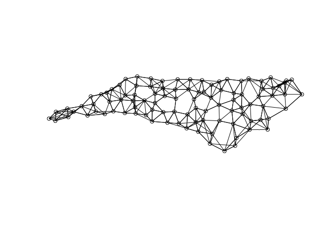
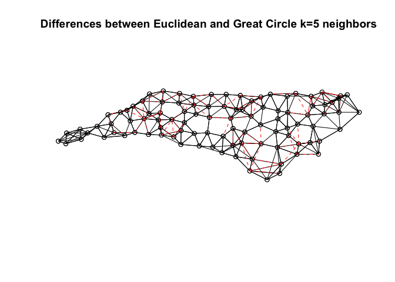

Spatial regression analysis in R
================
Carlos Mendez

<style>
h1.title {font-size: 18pt; color: DarkBlue;} 
body, h1, h2, h3, h4 {font-family: "Palatino", serif;}
body {font-size: 12pt;}
/* Headers */
h1,h2,h3,h4,h5,h6{font-size: 14pt; color: #00008B;}
body {color: #333333;}
a, a:hover {color: #8B3A62;}
pre {font-size: 12px;}
</style>

Suggested citation:

> Mendez C. (2020). Spatial regression analysis in R. R Studio/RPubs.
> Available at
> <https://rpubs.com/quarcs-lab/tutorial-spatial-regression>

This work is licensed under the Creative Commons Attribution-Non
Commercial-Share Alike 4.0 International License.

Acknowledgment:

Material adapted from multiple sources, in particular [BurkeyAcademy’s
GIS & Spatial Econometrics Project](https://spatial.burkeyacademy.com/)

# Libraries

``` r
knitr::opts_chunk$set(echo = TRUE)

library(tidyverse)  # Modern data science workflow
library(spdep)
library(spatialreg)
library(sf)
library(rgdal)
library(rgeos)


# Change the presentation of decimal numbers to 4 and avoid scientific notation
options(prompt="R> ", digits=4, scipen=7)
```

# Tutorial objectives

  - Import shapefiles into R

  - Import neighbor relationship from `.gal` files

  - Create neighbor relationships in R from shape files

  - Create neighbor relationships in R from shape latitude and longitude

  - Understand the difference between Great Circle and Euclidean
    distances

  - Export neighbor relationships as weight matrices to plain text files

  - Test for spatial dependence via the Moran’s I test

  - Evaluate the four simplest models of spatial regression

# Replication files

  - All necessary files can be downloaded from [BurkeyAcademy’s GIS &
    Spatial Econometrics Project](https://spatial.burkeyacademy.com/)

  - If you are a member of the [QuaRCS
    lab](https://quarcs-lab.rbind.io/), you can run this tutorial in [R
    Studio Cloud](https://rstudio.cloud/spaces/15597/project/965714) and
    access the files in the following [Github
    Repository](https://github.com/quarcs-lab/tutorial-spatial-regression)

# Preliminary material

  - [Overview of Spatial Econometric
    Models](https://youtu.be/6qZgchGCMds)

  - [Recall of spatial regression in GeoDa and its
    limitations](https://youtu.be/2IIXH5h6Gz0)

  - [R Spatial Data 1: Import shapefiles, create weights matrices, and
    run Moran’s I](https://youtu.be/_bnorgXbSG4)

  - [R Spatial Data 2: Make KNN from Lon/Lat text file and export as
    matrix](https://youtu.be/MtkuQxxQj5s)

  - [R Spatial Regression 1: The Four Simplest
    Models](https://youtu.be/b3HtV2Mhmvk)

  - [R Spatial Regression 2: All of the models, likelihood Ratio
    specification tests, and spatial
    Breusch-Pagan](https://youtu.be/MbQ4s8lwqGI)

# Import spatial data

Let us use the `readOGR` function from the `rgdal` library to import the
`.shp` file

``` r
#NCVACO <- readOGR(dsn = ".", layer = "data/NCVACO.shp")
NCVACO <- st_read("data/NCVACO.shp")
```

    ## Reading layer `NCVACO' from data source `/Users/carlos/GitHub/nb-quarcs/data/NCVACO.shp' using driver `ESRI Shapefile'
    ## Simple feature collection with 234 features and 49 fields
    ## geometry type:  MULTIPOLYGON
    ## dimension:      XY
    ## bbox:           xmin: -84.32 ymin: 33.84 xmax: -75.24 ymax: 39.47
    ## CRS:            4269

Note that the file is imported as a `SpatialPolygonsDataFrame` object

# Import neighbor relationship: `.gal` file

Let us use the `read.gal` function from the `rgdal` library to import
the `.gal` weights matrix created in GeoDa

``` r
queen.nb <- read.gal("data/NCVACO-Wqueen.gal", region.id=NCVACO$FIPS)
```

## Summarize neighbor relationships

``` r
summary(queen.nb)
```

    ## Neighbour list object:
    ## Number of regions: 234 
    ## Number of nonzero links: 1132 
    ## Percentage nonzero weights: 2.067 
    ## Average number of links: 4.838 
    ## Link number distribution:
    ## 
    ##  1  2  3  4  5  6  7  8  9 11 
    ## 16 26 22 32 36 49 37  9  6  1 
    ## 16 least connected regions:
    ## 51515 51530 51595 51660 51690 51720 51820 51131 51520 51540 51580 51600 51678 51790 51840 51001 with 1 link
    ## 1 most connected region:
    ## 51041 with 11 links

  - Is the is the neighbor relationship symmetric?

<!-- end list -->

``` r
is.symmetric.nb(queen.nb)
```

    ## [1] TRUE

# Create is the neighbor relationship in R

## From a shapefile

  - For queen contiguity

<!-- end list -->

``` r
queen.R.nb <- poly2nb(NCVACO, row.names = NCVACO$FIPS)
```

  - Alternatively, you can create a Rook contiguity relationship as

<!-- end list -->

``` r
rook.R.nb <- poly2nb(NCVACO, row.names = NCVACO$FIPS, queen=FALSE)
```

### Summarize neighbor relationships

``` r
summary(queen.R.nb)
```

    ## Neighbour list object:
    ## Number of regions: 234 
    ## Number of nonzero links: 1132 
    ## Percentage nonzero weights: 2.067 
    ## Average number of links: 4.838 
    ## Link number distribution:
    ## 
    ##  1  2  3  4  5  6  7  8  9 11 
    ## 16 26 22 32 36 49 37  9  6  1 
    ## 16 least connected regions:
    ## 46 47 49 52 54 55 58 180 207 208 210 212 217 227 230 232 with 1 link
    ## 1 most connected region:
    ## 147 with 11 links

  - Are the relationships symmetric?

<!-- end list -->

``` r
is.symmetric.nb(queen.R.nb)
```

    ## [1] TRUE

## From latitude and longitude

  - Import table

<!-- end list -->

``` r
nc.cent <- read.csv(file="data/CenPop2010_Mean_CO37.txt")
```

  - Identify coordinates

<!-- end list -->

``` r
nc.coords <- cbind(nc.cent$LONGITUDE, nc.cent$LATITUDE)
```

### Identify 5 nearest neighbors

#### The right way

Recognize that latitude and longitude are handled using **great circle
distances**

``` r
nc.5nn <- knearneigh(nc.coords, k=5, longlat = TRUE)
```

#### The wrong way

Fail to recognize that latitude and longitude are handled using great
circle distances. Latitude and longitude should not be used to compute
**Euclidean distances**

``` r
nc.5nn.wrong <- knearneigh(nc.coords, k=5, longlat = FALSE)
```

### Create 5 nearest neighbors relationship

``` r
nc.5nn.nb <- knn2nb(nc.5nn)
```

Plot the right neighbor relationship

``` r
plot(nc.5nn.nb, nc.coords)
```

<!-- -->

``` r
nc.5nn.nb.wrong <- knn2nb(nc.5nn.wrong)
```

Plot the wrong neighbor relationship

``` r
plot(nc.5nn.nb.wrong, nc.coords)
```

<!-- -->

Compare the differences

``` r
plot(nc.5nn.nb,nc.coords)
plot(diffnb(nc.5nn.nb, nc.5nn.nb.wrong), nc.coords, add=TRUE, col="red", lty=2)
title(main="Differences between Euclidean and Great Circle k=5 neighbors")
```

<!-- -->

## Compare neighbor relationships

  - Do the two queen-based neighbor relationships have the same
    structure?

<!-- end list -->

``` r
isTRUE(all.equal(queen.nb, queen.R.nb, check.attributes=FALSE))
```

    ## [1] TRUE

  - Do the two 5nn relationships have the same structure?

<!-- end list -->

``` r
isTRUE(all.equal(nc.5nn.nb, nc.5nn.nb.wrong, check.attributes=FALSE))
```

    ## [1] FALSE

## Export as plain text weight matrices

``` r
nc.5nn.mat <- nb2mat(nc.5nn.nb)
```

``` r
write.csv(nc.5nn.mat, file="data/nck5.csv")
```

## Note on storing and converting neighbor relationships

There are many ways to store weights matrices and contiguity files:

  - `listw` is used in most spdep commands

  - `nb` means neighbor file

  - `knn` is a k nearest neighbors object

  - `neigh` is another kind of neighbor file, common in ecology
    (e.g. package ade4)

  - `poly` stores it a “polygons” of a map file

There are many commands to convert one way of storing contiguity
information into another:

  - `poly2nb(object)` converts `polygon` to `nb`

  - `nb2listw(object)` converts `nb` to `listw`

# Test spatial autocorrelation

Let us use the Moran’s I based on the function `moran`, which need the
following arguments:

  - variable

  - neighbor relationship as a `listw` object

  - number of regions

  - sum of weights

<!-- end list -->

``` r
moranStatistic <- moran(NCVACO$SALESPC, nb2listw(queen.nb), length(NCVACO$SALESPC), Szero(nb2listw(queen.nb)))
moranStatistic
```

    ## $I
    ## [1] -0.01395
    ## 
    ## $K
    ## [1] 9.059

Moran statistic

``` r
moranStatistic[["I"]]
```

    ## [1] -0.01395

An alternative way of computing the test and a p value

``` r
moranTest <- moran.test(NCVACO$SALESPC, nb2listw(queen.nb))
moranTest
```

    ## 
    ##  Moran I test under randomisation
    ## 
    ## data:  NCVACO$SALESPC  
    ## weights: nb2listw(queen.nb)    
    ## 
    ## Moran I statistic standard deviate = -0.21, p-value = 0.6
    ## alternative hypothesis: greater
    ## sample estimates:
    ## Moran I statistic       Expectation          Variance 
    ##         -0.013949         -0.004292          0.002032

Moran Statistic

``` r
moranTest[["estimate"]][["Moran I statistic"]]
```

    ## [1] -0.01395

P-value

``` r
moranTest[["p.value"]]
```

    ## [1] 0.5848

# Regression models

## Import spatial data

``` r
#spat.data = readOGR(dsn = ".", layer = "NCVACO")
spat.data <- st_read("data/NCVACO.shp")
```

    ## Reading layer `NCVACO' from data source `/Users/carlos/GitHub/nb-quarcs/data/NCVACO.shp' using driver `ESRI Shapefile'
    ## Simple feature collection with 234 features and 49 fields
    ## geometry type:  MULTIPOLYGON
    ## dimension:      XY
    ## bbox:           xmin: -84.32 ymin: 33.84 xmax: -75.24 ymax: 39.47
    ## CRS:            4269

  - show variable names

<!-- end list -->

``` r
names(spat.data) 
```

    ##  [1] "GEO_ID"     "STATE"      "COUNTY"     "NAME"       "LSAD"      
    ##  [6] "CENSUSAREA" "FIPS2"      "Lon"        "Lat"        "FIPS"      
    ## [11] "qtystores"  "SALESPC"    "PCI"        "COMM15OVP"  "COLLENRP"  
    ## [16] "SOMECOLLP"  "ARMEDP"     "NONWHITEP"  "UNEMPP"     "ENTRECP"   
    ## [21] "PUBASSTP"   "POVPOPP"    "URBANP"     "FOREIGNBP"  "BAPTISTSP" 
    ## [26] "ADHERENTSP" "BKGRTOMIX"  "COUNTMXBV"  "MXBVSQM"    "BKGRTOABC" 
    ## [31] "MXBVPPOP18" "DUI1802"    "FVPTHH02"   "DC"         "GA"        
    ## [36] "KY"         "MD"         "SC"         "TN"         "WV"        
    ## [41] "VA"         "AREALANDSQ" "COUNTBKGR"  "TOTALPOP"   "POP18OV"   
    ## [46] "LABFORCE"   "HHOLDS"     "POP25OV"    "POP16OV"    "geometry"

This dataset is some data from some studies Mark Burkey did on liquor
demand using data from around 2003. In particular, he looks at the
states of Virginia and North Carolina. This dataset is related to, but
not the same as data used on an NIH grant and published in a paper:

> [Burkey, Mark L. Geographic Access and Demand in the Market for
> Alcohol. The Review of Regional Studies, 40(2),
> Fall 2010, 159-179](https://ideas.repec.org/p/pra/mprapa/36913.html)

Unit of analysis: counties in Virginia and North Carolina

Variable Descriptions:

  - `Lon Lat` Longitude and Latitude of County Centroid

  - `FIPS` FIPS Code for County (Federal Information Processing
    Standard)

  - `qtystores` \#Liquor Stores in County

  - `SALESPC` Liquor Sales per capita per year, $

  - `PCI` Per capita income

  - `COMM15OVP` % commuting over 15 minutes to work

  - `COLLENRP` % of people currently enrolled in college

  - `SOMECOLLP` % of people with “some college” or higher education
    level

  - `ARMEDP` % in armed forces

  - `NONWHITEP` % nonwhite

  - `UNEMPP` % unemployed

  - `ENTRECP` % employed i entertainment or recreation fields (proxy for
    tourism areas)

  - `PUBASSTP` % on public assistance of some sort

  - `POVPOPP` % in poverty

  - `URBANP` % living in urban areas

  - `FOREIGNBP` % foreign born

  - `BAPTISTSP` % southern baptist (historically anti-alcohol)

  - `ADHERENTSP` % adherents of any religion

  - `BKGRTOMIX` wtd. average distance from block group to nearest bar
    selling liquor

  - `COUNTMXBV` count of bars selling liquor

  - `MXBVSQM` bars per square mile

  - `BKGRTOABC` distance fro block group to nearest retail liquor outlet
    (“ABC stores”)

  - `MXBVPPOP18OV` Bars per 1,000? people 18 and older

  - `DUI1802` DUI arrests per 1,000 people 18+

  - `FVPTHH02` Offences against families and children (domestic
    violence) per 1,000 households

  - DC GA KY MD SC TN WV VA Dummy variables for counties bordering other
    states

  - `AREALANDSQMI` Area of county

  - `COUNTBKGR` count of block groups in county

  - `TOTALPOP` Population of county

  - `POP18OV` 18+ people in county

  - `LABFORCE` number in labor force in county

  - `HHOLDS` \# households in county

  - `POP25OV` Pop 25+ in county

  - `POP16OV` Pop 16+ in county

  - summarize imported data

<!-- end list -->

``` r
summary(spat.data)
```

    ##     GEO_ID             STATE              COUNTY              NAME          
    ##  Length:234         Length:234         Length:234         Length:234        
    ##  Class :character   Class :character   Class :character   Class :character  
    ##  Mode  :character   Mode  :character   Mode  :character   Mode  :character  
    ##                                                                             
    ##                                                                             
    ##                                                                             
    ##      LSAD             CENSUSAREA     FIPS2                Lon       
    ##  Length:234         Min.   :  2   Length:234         Min.   :-83.9  
    ##  Class :character   1st Qu.:234   Class :character   1st Qu.:-80.3  
    ##  Mode  :character   Median :381   Mode  :character   Median :-78.5  
    ##                     Mean   :376                      Mean   :-78.9  
    ##                     3rd Qu.:514                      3rd Qu.:-77.4  
    ##                     Max.   :969                      Max.   :-75.6  
    ##       Lat            FIPS         qtystores        SALESPC           PCI       
    ##  Min.   :34.2   Min.   :37001   Min.   : 0.00   Min.   :  0.0   Min.   :12808  
    ##  1st Qu.:35.8   1st Qu.:37118   1st Qu.: 1.00   1st Qu.: 38.0   1st Qu.:16154  
    ##  Median :36.8   Median :51034   Median : 2.00   Median : 58.8   Median :18073  
    ##  Mean   :36.7   Mean   :45212   Mean   : 2.78   Mean   : 65.0   Mean   :19003  
    ##  3rd Qu.:37.5   3rd Qu.:51158   3rd Qu.: 3.00   3rd Qu.: 78.7   3rd Qu.:20504  
    ##  Max.   :39.2   Max.   :51840   Max.   :23.00   Max.   :297.7   Max.   :41014  
    ##    COMM15OVP        COLLENRP       SOMECOLLP        ARMEDP      
    ##  Min.   : 5.49   Min.   : 0.89   Min.   :16.6   Min.   : 0.000  
    ##  1st Qu.:25.89   1st Qu.: 2.66   1st Qu.:23.4   1st Qu.: 0.020  
    ##  Median :30.42   Median : 3.18   Median :27.1   Median : 0.080  
    ##  Mean   :30.52   Mean   : 4.58   Mean   :28.8   Mean   : 0.666  
    ##  3rd Qu.:34.96   3rd Qu.: 4.18   3rd Qu.:32.4   3rd Qu.: 0.240  
    ##  Max.   :48.79   Max.   :41.30   Max.   :59.9   Max.   :21.530  
    ##    NONWHITEP         UNEMPP         ENTRECP         PUBASSTP       POVPOPP     
    ##  Min.   : 0.67   Min.   : 1.71   Min.   : 2.84   Min.   :0.48   Min.   : 2.75  
    ##  1st Qu.: 8.93   1st Qu.: 3.63   1st Qu.: 4.90   1st Qu.:2.00   1st Qu.: 9.17  
    ##  Median :22.17   Median : 4.67   Median : 5.77   Median :2.76   Median :12.57  
    ##  Mean   :24.76   Mean   : 5.27   Mean   : 6.44   Mean   :3.10   Mean   :13.05  
    ##  3rd Qu.:37.80   3rd Qu.: 6.45   3rd Qu.: 7.42   3rd Qu.:3.89   3rd Qu.:16.71  
    ##  Max.   :81.59   Max.   :41.41   Max.   :22.54   Max.   :8.65   Max.   :31.35  
    ##      URBANP         FOREIGNBP        BAPTISTSP       ADHERENTSP   
    ##  Min.   :  0.00   Min.   : 0.000   Min.   : 0.00   Min.   : 13.3  
    ##  1st Qu.:  5.94   1st Qu.: 0.500   1st Qu.: 9.19   1st Qu.: 35.2  
    ##  Median : 33.84   Median : 0.995   Median :14.11   Median : 43.1  
    ##  Mean   : 41.16   Mean   : 1.854   Mean   :15.72   Mean   : 45.2  
    ##  3rd Qu.: 70.97   3rd Qu.: 2.243   3rd Qu.:21.25   3rd Qu.: 50.7  
    ##  Max.   :100.00   Max.   :16.120   Max.   :60.13   Max.   :164.5  
    ##    BKGRTOMIX       COUNTMXBV        MXBVSQM        BKGRTOABC     
    ##  Min.   : 0.26   Min.   :  0.0   Min.   :0.000   Min.   : 0.549  
    ##  1st Qu.: 1.96   1st Qu.:  2.0   1st Qu.:0.003   1st Qu.: 2.804  
    ##  Median : 3.65   Median :  7.0   Median :0.022   Median : 4.433  
    ##  Mean   : 5.37   Mean   : 29.7   Mean   :0.414   Mean   : 4.903  
    ##  3rd Qu.: 6.86   3rd Qu.: 24.8   3rd Qu.:0.129   3rd Qu.: 5.974  
    ##  Max.   :38.27   Max.   :543.0   Max.   :8.697   Max.   :21.501  
    ##    MXBVPPOP18       DUI1802         FVPTHH02            DC        
    ##  Min.   : 0.00   Min.   : 0.25   Min.   : 0.000   Min.   :0.0000  
    ##  1st Qu.: 1.08   1st Qu.: 4.43   1st Qu.: 0.074   1st Qu.:0.0000  
    ##  Median : 3.21   Median : 6.92   Median : 0.382   Median :0.0000  
    ##  Mean   : 4.57   Mean   : 7.78   Mean   : 1.644   Mean   :0.0128  
    ##  3rd Qu.: 6.50   3rd Qu.: 9.92   3rd Qu.: 2.146   3rd Qu.:0.0000  
    ##  Max.   :39.78   Max.   :32.78   Max.   :20.458   Max.   :1.0000  
    ##        GA               KY               MD               SC        
    ##  Min.   :0.0000   Min.   :0.0000   Min.   :0.0000   Min.   :0.0000  
    ##  1st Qu.:0.0000   1st Qu.:0.0000   1st Qu.:0.0000   1st Qu.:0.0000  
    ##  Median :0.0000   Median :0.0000   Median :0.0000   Median :0.0000  
    ##  Mean   :0.0171   Mean   :0.0128   Mean   :0.0214   Mean   :0.0726  
    ##  3rd Qu.:0.0000   3rd Qu.:0.0000   3rd Qu.:0.0000   3rd Qu.:0.0000  
    ##  Max.   :1.0000   Max.   :1.0000   Max.   :1.0000   Max.   :1.0000  
    ##        TN               WV               VA          AREALANDSQ 
    ##  Min.   :0.0000   Min.   :0.0000   Min.   :0.000   Min.   :  2  
    ##  1st Qu.:0.0000   1st Qu.:0.0000   1st Qu.:0.000   1st Qu.:236  
    ##  Median :0.0000   Median :0.0000   Median :1.000   Median :382  
    ##  Mean   :0.0598   Mean   :0.0641   Mean   :0.573   Mean   :377  
    ##  3rd Qu.:0.0000   3rd Qu.:0.0000   3rd Qu.:1.000   3rd Qu.:519  
    ##  Max.   :1.0000   Max.   :1.0000   Max.   :1.000   Max.   :971  
    ##    COUNTBKGR        TOTALPOP         POP18OV          LABFORCE     
    ##  Min.   :  2.0   Min.   :  2536   Min.   :  2031   Min.   :  1203  
    ##  1st Qu.: 12.0   1st Qu.: 15758   1st Qu.: 12205   1st Qu.:  7359  
    ##  Median : 24.5   Median : 32329   Median : 24366   Median : 15612  
    ##  Mean   : 42.7   Mean   : 64631   Mean   : 48835   Mean   : 33433  
    ##  3rd Qu.: 49.0   3rd Qu.: 65528   3rd Qu.: 50604   3rd Qu.: 33478  
    ##  Max.   :532.0   Max.   :969749   Max.   :724019   Max.   :548812  
    ##      HHOLDS          POP25OV          POP16OV                geometry  
    ##  Min.   :  1122   Min.   :  1929   Min.   :  2101   MULTIPOLYGON :234  
    ##  1st Qu.:  6114   1st Qu.: 10856   1st Qu.: 12670   epsg:4269    :  0  
    ##  Median : 12279   Median : 21328   Median : 25248   +proj=long...:  0  
    ##  Mean   : 24922   Mean   : 42506   Mean   : 50500                      
    ##  3rd Qu.: 25320   3rd Qu.: 43408   3rd Qu.: 52174                      
    ##  Max.   :351279   Max.   :653237   Max.   :750436

### Transform variables

  - From categorical factor to numeric

<!-- end list -->

``` r
spat.data$PCI <- as.numeric(levels(spat.data$PCI))[spat.data$PCI]
```

## Spatial distribution

``` r
#spplot(spat.data, "SALESPC") 
```

## Spatial weights

  - Create neighbor relationships

<!-- end list -->

``` r
queen.nb <- poly2nb(spat.data) 
rook.nb  <- poly2nb(spat.data, queen=FALSE) 
```

  - convert `nb` to `listw` type

<!-- end list -->

``` r
queen.listw <- nb2listw(queen.nb) 
rook.listw  <- nb2listw(rook.nb) 
```

  - use a shorter name

<!-- end list -->

``` r
listw1 <-  queen.listw
```

# Classical approach

## The four simplest models


Re-watch the video [“The Four Simplest
Models”](https://youtu.be/b3HtV2Mhmvk)

## Model 1: OLS

  - define regression equation, so we don’t have to type it each time

<!-- end list -->

``` r
reg.eq1 <- DUI1802 ~ SALESPC + COLLENRP + BKGRTOABC + BAPTISTSP + BKGRTOMIX + ENTRECP
```

``` r
reg1 <- lm(reg.eq1, data = spat.data)
summary(reg1)
```

    ## 
    ## Call:
    ## lm(formula = reg.eq1, data = spat.data)
    ## 
    ## Residuals:
    ##    Min     1Q Median     3Q    Max 
    ## -9.048 -3.125 -0.727  2.078 25.845 
    ## 
    ## Coefficients:
    ##             Estimate Std. Error t value Pr(>|t|)   
    ## (Intercept)  3.67323    1.31807    2.79   0.0058 **
    ## SALESPC      0.01334    0.00839    1.59   0.1131   
    ## COLLENRP     0.00775    0.06557    0.12   0.9061   
    ## BKGRTOABC    0.03207    0.14760    0.22   0.8282   
    ## BAPTISTSP    0.06723    0.03606    1.86   0.0636 . 
    ## BKGRTOMIX    0.08061    0.07601    1.06   0.2900   
    ## ENTRECP      0.24194    0.14733    1.64   0.1019   
    ## ---
    ## Signif. codes:  0 '***' 0.001 '**' 0.01 '*' 0.05 '.' 0.1 ' ' 1
    ## 
    ## Residual standard error: 4.98 on 227 degrees of freedom
    ## Multiple R-squared:  0.0584, Adjusted R-squared:  0.0335 
    ## F-statistic: 2.34 on 6 and 227 DF,  p-value: 0.0324

### Check residual spatial dependence

``` r
lmMoranTest <- lm.morantest(reg1,listw1)
lmMoranTest
```

    ## 
    ##  Global Moran I for regression residuals
    ## 
    ## data:  
    ## model: lm(formula = reg.eq1, data = spat.data)
    ## weights: listw1
    ## 
    ## Moran I statistic standard deviate = 4.6, p-value = 0.000002
    ## alternative hypothesis: greater
    ## sample estimates:
    ## Observed Moran I      Expectation         Variance 
    ##         0.197279        -0.010566         0.002049

### Model selection via LM tests

 Source: Anselin (1988), Burkey (2018)

``` r
lmLMtests <- lm.LMtests(reg1, listw1, test=c("LMerr", "LMlag", "RLMerr", "RLMlag", "SARMA"))
lmLMtests
```

    ## 
    ##  Lagrange multiplier diagnostics for spatial dependence
    ## 
    ## data:  
    ## model: lm(formula = reg.eq1, data = spat.data)
    ## weights: listw1
    ## 
    ## LMerr = 18, df = 1, p-value = 0.00002
    ## 
    ## 
    ##  Lagrange multiplier diagnostics for spatial dependence
    ## 
    ## data:  
    ## model: lm(formula = reg.eq1, data = spat.data)
    ## weights: listw1
    ## 
    ## LMlag = 24, df = 1, p-value = 0.000001
    ## 
    ## 
    ##  Lagrange multiplier diagnostics for spatial dependence
    ## 
    ## data:  
    ## model: lm(formula = reg.eq1, data = spat.data)
    ## weights: listw1
    ## 
    ## RLMerr = 11, df = 1, p-value = 0.001
    ## 
    ## 
    ##  Lagrange multiplier diagnostics for spatial dependence
    ## 
    ## data:  
    ## model: lm(formula = reg.eq1, data = spat.data)
    ## weights: listw1
    ## 
    ## RLMlag = 16, df = 1, p-value = 0.00006
    ## 
    ## 
    ##  Lagrange multiplier diagnostics for spatial dependence
    ## 
    ## data:  
    ## model: lm(formula = reg.eq1, data = spat.data)
    ## weights: listw1
    ## 
    ## SARMA = 35, df = 2, p-value = 0.00000003

Based on these results (Lowest is RLMlag), we would choose the spatial
lag model

## Model 2: SLX

Spatially Lagged X y=Xß+WXT+e p=rho, T=theta, and L=lambda

``` r
reg2 = lmSLX(reg.eq1, data = spat.data, listw1)
summary(reg2)
```

    ## 
    ## Call:
    ## lm(formula = formula(paste("y ~ ", paste(colnames(x)[-1], collapse = "+"))), 
    ##     data = as.data.frame(x), weights = weights)
    ## 
    ## Residuals:
    ##     Min      1Q  Median      3Q     Max 
    ## -11.472  -3.008  -0.536   1.818  25.056 
    ## 
    ## Coefficients:
    ##                 Estimate Std. Error t value Pr(>|t|)   
    ## (Intercept)    1.5105293  2.5747239    0.59   0.5580   
    ## SALESPC        0.0154612  0.0083614    1.85   0.0658 . 
    ## COLLENRP       0.0567602  0.0654168    0.87   0.3865   
    ## BKGRTOABC      0.2227781  0.1543080    1.44   0.1502   
    ## BAPTISTSP     -0.0000135  0.0446868    0.00   0.9998   
    ## BKGRTOMIX     -0.2143435  0.1041711   -2.06   0.0408 * 
    ## ENTRECP       -0.0448487  0.1588845   -0.28   0.7780   
    ## lag.SALESPC    0.0264937  0.0205916    1.29   0.1996   
    ## lag.COLLENRP  -0.2600258  0.2054739   -1.27   0.2070   
    ## lag.BKGRTOABC -0.4691910  0.3047671   -1.54   0.1251   
    ## lag.BAPTISTSP  0.1100568  0.0597374    1.84   0.0668 . 
    ## lag.BKGRTOMIX  0.5278804  0.1670141    3.16   0.0018 **
    ## lag.ENTRECP    0.4328176  0.2512396    1.72   0.0863 . 
    ## ---
    ## Signif. codes:  0 '***' 0.001 '**' 0.01 '*' 0.05 '.' 0.1 ' ' 1
    ## 
    ## Residual standard error: 4.78 on 221 degrees of freedom
    ## Multiple R-squared:  0.154,  Adjusted R-squared:  0.108 
    ## F-statistic: 3.35 on 12 and 221 DF,  p-value: 0.000168

### Marginal effects

Even in the case of the SLX model, you need to think about total impact
(Direct+Indirect)

``` r
impacts(reg2, listw = listw1)
```

    ## Impact measures (SLX, estimable):
    ##                Direct Indirect    Total
    ## SALESPC    0.01546115  0.02649  0.04195
    ## COLLENRP   0.05676021 -0.26003 -0.20327
    ## BKGRTOABC  0.22277806 -0.46919 -0.24641
    ## BAPTISTSP -0.00001348  0.11006  0.11004
    ## BKGRTOMIX -0.21434352  0.52788  0.31354
    ## ENTRECP   -0.04484868  0.43282  0.38797

  - Add se errors and p-values

(R=500 not actually needed for SLX)

``` r
summary(impacts(reg2, listw=listw1, R=500), zstats = TRUE) 
```

    ## Impact measures (SLX, estimable, n-k):
    ##                Direct Indirect    Total
    ## SALESPC    0.01546115  0.02649  0.04195
    ## COLLENRP   0.05676021 -0.26003 -0.20327
    ## BKGRTOABC  0.22277806 -0.46919 -0.24641
    ## BAPTISTSP -0.00001348  0.11006  0.11004
    ## BKGRTOMIX -0.21434352  0.52788  0.31354
    ## ENTRECP   -0.04484868  0.43282  0.38797
    ## ========================================================
    ## Standard errors:
    ##             Direct Indirect   Total
    ## SALESPC   0.008361  0.02059 0.02290
    ## COLLENRP  0.065417  0.20547 0.20255
    ## BKGRTOABC 0.154308  0.30477 0.29311
    ## BAPTISTSP 0.044687  0.05974 0.04766
    ## BKGRTOMIX 0.104171  0.16701 0.12555
    ## ENTRECP   0.158885  0.25124 0.24909
    ## ========================================================
    ## Z-values:
    ##               Direct Indirect   Total
    ## SALESPC    1.8491075    1.287  1.8324
    ## COLLENRP   0.8676702   -1.265 -1.0035
    ## BKGRTOABC  1.4437231   -1.540 -0.8407
    ## BAPTISTSP -0.0003015    1.842  2.3091
    ## BKGRTOMIX -2.0576102    3.161  2.4973
    ## ENTRECP   -0.2822722    1.723  1.5576
    ## 
    ## p-values:
    ##           Direct Indirect Total
    ## SALESPC   0.064  0.1982   0.067
    ## COLLENRP  0.386  0.2057   0.316
    ## BKGRTOABC 0.149  0.1237   0.401
    ## BAPTISTSP 1.000  0.0654   0.021
    ## BKGRTOMIX 0.040  0.0016   0.013
    ## ENTRECP   0.778  0.0849   0.119

## Model 3: SAR

y=pWy+XB+e

``` r
reg3 <- lagsarlm(reg.eq1, data = spat.data, listw1)
summary(reg3)
```

    ## 
    ## Call:lagsarlm(formula = reg.eq1, data = spat.data, listw = listw1)
    ## 
    ## Residuals:
    ##      Min       1Q   Median       3Q      Max 
    ## -7.18539 -2.59660 -0.77605  1.61369 25.93228 
    ## 
    ## Type: lag 
    ## Coefficients: (asymptotic standard errors) 
    ##              Estimate Std. Error z value Pr(>|z|)
    ## (Intercept) 1.5421139  1.3012975  1.1851  0.23599
    ## SALESPC     0.0138185  0.0077171  1.7906  0.07335
    ## COLLENRP    0.0327744  0.0603469  0.5431  0.58706
    ## BKGRTOABC   0.1164671  0.1358375  0.8574  0.39122
    ## BAPTISTSP   0.0392792  0.0332872  1.1800  0.23800
    ## BKGRTOMIX   0.0092150  0.0700728  0.1315  0.89538
    ## ENTRECP     0.1532086  0.1359122  1.1273  0.25963
    ## 
    ## Rho: 0.3983, LR test value: 22.92, p-value: 0.0000016858
    ## Asymptotic standard error: 0.07512
    ##     z-value: 5.302, p-value: 0.00000011459
    ## Wald statistic: 28.11, p-value: 0.00000011459
    ## 
    ## Log likelihood: -692.7 for lag model
    ## ML residual variance (sigma squared): 21.01, (sigma: 4.584)
    ## Number of observations: 234 
    ## Number of parameters estimated: 9 
    ## AIC: 1403, (AIC for lm: 1424)
    ## LM test for residual autocorrelation
    ## test value: 13.05, p-value: 0.0003037

### Marginal effects

Remember that when you use the spatial lag model, you cannot interpret
Betas as marginal effects, you have to use the `impacts` function and
obtain direct and indirect effects.

``` r
impacts(reg3, listw = listw1)
```

    ## Impact measures (lag, exact):
    ##             Direct Indirect   Total
    ## SALESPC   0.014383 0.008582 0.02297
    ## COLLENRP  0.034112 0.020356 0.05447
    ## BKGRTOABC 0.121222 0.072336 0.19356
    ## BAPTISTSP 0.040883 0.024396 0.06528
    ## BKGRTOMIX 0.009591 0.005723 0.01531
    ## ENTRECP   0.159463 0.095155 0.25462

  - evaluate p-values

<!-- end list -->

``` r
# The code below works, but it takes some time. I will skip it for now
#summary(impacts(reg3, listw=listw1, R=500),zstats=TRUE)
```

Caution: These p-values are simulated, and seem to vary a bit from run
to run.

## Model 4: SEM

y=XB+u, u=LWu+e

``` r
reg4 <- errorsarlm(reg.eq1, data=spat.data, listw1)
summary(reg4)
```

    ## 
    ## Call:errorsarlm(formula = reg.eq1, data = spat.data, listw = listw1)
    ## 
    ## Residuals:
    ##      Min       1Q   Median       3Q      Max 
    ## -7.21199 -2.66820 -0.85841  1.57794 25.85910 
    ## 
    ## Type: error 
    ## Coefficients: (asymptotic standard errors) 
    ##               Estimate Std. Error z value  Pr(>|z|)
    ## (Intercept)  5.1218025  1.4443139  3.5462 0.0003909
    ## SALESPC      0.0111587  0.0076284  1.4628 0.1435286
    ## COLLENRP     0.0533827  0.0617209  0.8649 0.3870915
    ## BKGRTOABC    0.1533586  0.1454500  1.0544 0.2917121
    ## BAPTISTSP    0.0326804  0.0394447  0.8285 0.4073797
    ## BKGRTOMIX   -0.0232354  0.0832068 -0.2792 0.7800541
    ## ENTRECP      0.1067644  0.1449288  0.7367 0.4613242
    ## 
    ## Lambda: 0.4034, LR test value: 20.07, p-value: 0.0000074467
    ## Asymptotic standard error: 0.07545
    ##     z-value: 5.347, p-value: 0.000000089438
    ## Wald statistic: 28.59, p-value: 0.000000089438
    ## 
    ## Log likelihood: -694.1 for error model
    ## ML residual variance (sigma squared): 21.25, (sigma: 4.609)
    ## Number of observations: 234 
    ## Number of parameters estimated: 9 
    ## AIC: 1406, (AIC for lm: 1424)

### Spatial Hausman Test

``` r
HausmanTest <- Hausman.test(reg4)
HausmanTest
```

    ## 
    ##  Spatial Hausman test (asymptotic)
    ## 
    ## data:  NULL
    ## Hausman test = 14, df = 7, p-value = 0.06

[Pace, R.K. and LeSage, J.P., 2008. A spatial Hausman test. Economics
Letters, 101(3),
pp.282-284.](https://www.sciencedirect.com/science/article/abs/pii/S016517650800270X)

# Modern approach

Re-watch this video: [R Spatial Regression 2: All of the models,
likelihood Ratio specification tests, and spatial
Breusch-Pagan](https://youtu.be/MbQ4s8lwqGI)

 Source: Burkey (2018)

## Model 5: SDEM (Spatial Durbin Error)

add lag X to SEM

y=XB+WxT+u, u=LWu+e

``` r
reg5 <- errorsarlm(reg.eq1, data = spat.data, listw1, etype = "emixed")
summary(reg5)
```

    ## 
    ## Call:errorsarlm(formula = reg.eq1, data = spat.data, listw = listw1, 
    ##     etype = "emixed")
    ## 
    ## Residuals:
    ##      Min       1Q   Median       3Q      Max 
    ## -7.95062 -2.74043 -0.59773  1.73425 25.27727 
    ## 
    ## Type: error 
    ## Coefficients: (asymptotic standard errors) 
    ##                 Estimate Std. Error z value Pr(>|z|)
    ## (Intercept)   -0.3840410  2.8953907 -0.1326  0.89448
    ## SALESPC        0.0165780  0.0081385  2.0370  0.04165
    ## COLLENRP       0.0441074  0.0606147  0.7277  0.46682
    ## BKGRTOABC      0.1974946  0.1414555  1.3962  0.16267
    ## BAPTISTSP      0.0158627  0.0395729  0.4008  0.68853
    ## BKGRTOMIX     -0.1598168  0.0911062 -1.7542  0.07940
    ## ENTRECP        0.0035284  0.1456543  0.0242  0.98067
    ## lag.SALESPC    0.0387738  0.0203731  1.9032  0.05702
    ## lag.COLLENRP  -0.3217522  0.2056446 -1.5646  0.11768
    ## lag.BKGRTOABC -0.0956966  0.3052079 -0.3135  0.75387
    ## lag.BAPTISTSP  0.0669554  0.0615853  1.0872  0.27695
    ## lag.BKGRTOMIX  0.3129327  0.1663462  1.8812  0.05994
    ## lag.ENTRECP    0.5558552  0.2641380  2.1044  0.03534
    ## 
    ## Lambda: 0.3522, LR test value: 14.11, p-value: 0.00017285
    ## Asymptotic standard error: 0.07858
    ##     z-value: 4.482, p-value: 0.000007405
    ## Wald statistic: 20.09, p-value: 0.000007405
    ## 
    ## Log likelihood: -684.6 for error model
    ## ML residual variance (sigma squared): 19.78, (sigma: 4.447)
    ## Number of observations: 234 
    ## Number of parameters estimated: 15 
    ## AIC: 1399, (AIC for lm: 1411)

### Marginal effects

``` r
impacts(reg5,listw=listw.wts)
```

    ## Impact measures (SDEM, estimable):
    ##              Direct Indirect    Total
    ## SALESPC    0.016578  0.03877  0.05535
    ## COLLENRP   0.044107 -0.32175 -0.27764
    ## BKGRTOABC  0.197495 -0.09570  0.10180
    ## BAPTISTSP  0.015863  0.06696  0.08282
    ## BKGRTOMIX -0.159817  0.31293  0.15312
    ## ENTRECP    0.003528  0.55586  0.55938

``` r
summary(impacts(reg5, listw=listw.wts, R=500),zstats=TRUE)
```

    ## Impact measures (SDEM, estimable, n):
    ##              Direct Indirect    Total
    ## SALESPC    0.016578  0.03877  0.05535
    ## COLLENRP   0.044107 -0.32175 -0.27764
    ## BKGRTOABC  0.197495 -0.09570  0.10180
    ## BAPTISTSP  0.015863  0.06696  0.08282
    ## BKGRTOMIX -0.159817  0.31293  0.15312
    ## ENTRECP    0.003528  0.55586  0.55938
    ## ========================================================
    ## Standard errors:
    ##             Direct Indirect   Total
    ## SALESPC   0.008138  0.02037 0.02456
    ## COLLENRP  0.060615  0.20564 0.21829
    ## BKGRTOABC 0.141456  0.30521 0.33425
    ## BAPTISTSP 0.039573  0.06159 0.06246
    ## BKGRTOMIX 0.091106  0.16635 0.15194
    ## ENTRECP   0.145654  0.26414 0.30514
    ## ========================================================
    ## Z-values:
    ##             Direct Indirect   Total
    ## SALESPC    2.03700   1.9032  2.2536
    ## COLLENRP   0.72767  -1.5646 -1.2719
    ## BKGRTOABC  1.39616  -0.3135  0.3046
    ## BAPTISTSP  0.40085   1.0872  1.3259
    ## BKGRTOMIX -1.75418   1.8812  1.0077
    ## ENTRECP    0.02422   2.1044  1.8332
    ## 
    ## p-values:
    ##           Direct Indirect Total
    ## SALESPC   0.042  0.057    0.024
    ## COLLENRP  0.467  0.118    0.203
    ## BKGRTOABC 0.163  0.754    0.761
    ## BAPTISTSP 0.689  0.277    0.185
    ## BKGRTOMIX 0.079  0.060    0.314
    ## ENTRECP   0.981  0.035    0.067

## Model 6: SDM (Spatial Durbin Model)

add lag X to SAR

y=pWy+XB+WXT+e

``` r
reg6 <- lagsarlm(reg.eq1, data = spat.data, listw1, type="mixed")
summary(reg6)
```

    ## 
    ## Call:lagsarlm(formula = reg.eq1, data = spat.data, listw = listw1, 
    ##     type = "mixed")
    ## 
    ## Residuals:
    ##      Min       1Q   Median       3Q      Max 
    ## -8.88614 -2.73500 -0.54014  1.56418 25.08356 
    ## 
    ## Type: mixed 
    ## Coefficients: (asymptotic standard errors) 
    ##                 Estimate Std. Error z value Pr(>|z|)
    ## (Intercept)   -0.3019916  2.3986911 -0.1259  0.89981
    ## SALESPC        0.0142404  0.0077820  1.8299  0.06726
    ## COLLENRP       0.0713529  0.0609564  1.1706  0.24178
    ## BKGRTOABC      0.2315929  0.1434207  1.6148  0.10636
    ## BAPTISTSP      0.0029546  0.0415389  0.0711  0.94330
    ## BKGRTOMIX     -0.2098770  0.0969290 -2.1653  0.03037
    ## ENTRECP       -0.0676565  0.1479659 -0.4572  0.64750
    ## lag.SALESPC    0.0269862  0.0191874  1.4065  0.15959
    ## lag.COLLENRP  -0.2777127  0.1909852 -1.4541  0.14592
    ## lag.BKGRTOABC -0.2682605  0.2830702 -0.9477  0.34329
    ## lag.BAPTISTSP  0.0600813  0.0557165  1.0783  0.28088
    ## lag.BKGRTOMIX  0.3952195  0.1553486  2.5441  0.01096
    ## lag.ENTRECP    0.4109060  0.2345201  1.7521  0.07975
    ## 
    ## Rho: 0.3356, LR test value: 15.12, p-value: 0.000101
    ## Asymptotic standard error: 0.07813
    ##     z-value: 4.296, p-value: 0.000017396
    ## Wald statistic: 18.45, p-value: 0.000017396
    ## 
    ## Log likelihood: -684.1 for mixed model
    ## ML residual variance (sigma squared): 19.75, (sigma: 4.444)
    ## Number of observations: 234 
    ## Number of parameters estimated: 15 
    ## AIC: 1398, (AIC for lm: 1411)
    ## LM test for residual autocorrelation
    ## test value: 3.126, p-value: 0.077063

### Marginal effects

``` r
impacts(reg6,listw=listw1)
```

    ## Impact measures (mixed, exact):
    ##              Direct Indirect    Total
    ## SALESPC    0.016866  0.04519  0.06205
    ## COLLENRP   0.050375 -0.36099 -0.31061
    ## BKGRTOABC  0.215842 -0.27103 -0.05519
    ## BAPTISTSP  0.008003  0.08688  0.09488
    ## BKGRTOMIX -0.183029  0.46200  0.27898
    ## ENTRECP   -0.035565  0.55222  0.51665

``` r
#summary(impacts(reg6,listw=listw1,R=500),zstats=TRUE)
```

## Model 7: Manski

All inclusive

Not recommended

y=pWy+XB+WXT+u, u=LWu+e

``` r
reg7 <- sacsarlm(reg.eq1, data = spat.data, listw1, type="sacmixed") 
summary(reg7)
```

    ## 
    ## Call:sacsarlm(formula = reg.eq1, data = spat.data, listw = listw1, 
    ##     type = "sacmixed")
    ## 
    ## Residuals:
    ##       Min        1Q    Median        3Q       Max 
    ## -10.06691  -2.49565  -0.56282   1.24359  23.46396 
    ## 
    ## Type: sacmixed 
    ## Coefficients: (asymptotic standard errors) 
    ##                 Estimate Std. Error z value Pr(>|z|)
    ## (Intercept)   -0.3461499  1.8190266 -0.1903 0.849079
    ## SALESPC        0.0142023  0.0075629  1.8779 0.060397
    ## COLLENRP       0.0749423  0.0611370  1.2258 0.220270
    ## BKGRTOABC      0.3189465  0.1456353  2.1900 0.028522
    ## BAPTISTSP     -0.0140530  0.0431183 -0.3259 0.744487
    ## BKGRTOMIX     -0.2736495  0.0979738 -2.7931 0.005221
    ## ENTRECP       -0.0616431  0.1509625 -0.4083 0.683029
    ## lag.SALESPC    0.0100316  0.0174324  0.5755 0.564982
    ## lag.COLLENRP  -0.2004362  0.1647538 -1.2166 0.223764
    ## lag.BKGRTOABC -0.3727231  0.2579012 -1.4452 0.148397
    ## lag.BAPTISTSP  0.0440849  0.0526102  0.8380 0.402057
    ## lag.BKGRTOMIX  0.4125315  0.1423864  2.8973 0.003764
    ## lag.ENTRECP    0.2425248  0.2098756  1.1556 0.247859
    ## 
    ## Rho: 0.6649
    ## Asymptotic standard error: 0.0911
    ##     z-value: 7.299, p-value: 2.9066e-13
    ## Lambda: -0.5252
    ## Asymptotic standard error: 0.1555
    ##     z-value: -3.378, p-value: 0.00072879
    ## 
    ## LR test value: 44.72, p-value: 0.00000041502
    ## 
    ## Log likelihood: -681.8 for sacmixed model
    ## ML residual variance (sigma squared): 16.63, (sigma: 4.078)
    ## Number of observations: 234 
    ## Number of parameters estimated: 16 
    ## AIC: 1396, (AIC for lm: 1424)

### Marginal effects

``` r
impacts(reg7,listw=listw1)
```

    ## Impact measures (sacmixed, exact):
    ##              Direct Indirect    Total
    ## SALESPC    0.018650  0.05367  0.07232
    ## COLLENRP   0.040547 -0.41506 -0.37451
    ## BKGRTOABC  0.282258 -0.44274 -0.16049
    ## BAPTISTSP -0.006119  0.09574  0.08963
    ## BKGRTOMIX -0.220991  0.63546  0.41447
    ## ENTRECP   -0.015617  0.55543  0.53981

``` r
#summary(impacts(reg7,listw=listw1,R=500),zstats=TRUE)
```

## Model 8: SARAR

a.k.a. Kelejian-Prucha, Cliff-Ord, or SAC

If all T=0,y=pWy+XB+u, u=LWu+e

``` r
reg8 <- sacsarlm(reg.eq1, data = spat.data, listw1, type="sac")
summary(reg8)
```

    ## 
    ## Call:sacsarlm(formula = reg.eq1, data = spat.data, listw = listw1, 
    ##     type = "sac")
    ## 
    ## Residuals:
    ##      Min       1Q   Median       3Q      Max 
    ## -7.01945 -2.34197 -0.78281  1.41007 23.48056 
    ## 
    ## Type: sac 
    ## Coefficients: (asymptotic standard errors) 
    ##               Estimate Std. Error z value Pr(>|z|)
    ## (Intercept) -0.8353870  0.9351383 -0.8933  0.37168
    ## SALESPC      0.0171848  0.0067612  2.5417  0.01103
    ## COLLENRP     0.0138969  0.0505268  0.2750  0.78328
    ## BKGRTOABC    0.1404632  0.1045255  1.3438  0.17901
    ## BAPTISTSP    0.0211294  0.0225887  0.9354  0.34958
    ## BKGRTOMIX   -0.0214055  0.0491538 -0.4355  0.66321
    ## ENTRECP      0.1409664  0.1061888  1.3275  0.18434
    ## 
    ## Rho: 0.7415
    ## Asymptotic standard error: 0.06907
    ##     z-value: 10.74, p-value: < 2.22e-16
    ## Lambda: -0.6036
    ## Asymptotic standard error: 0.1338
    ##     z-value: -4.513, p-value: 0.0000064082
    ## 
    ## LR test value: 32.47, p-value: 0.000000088832
    ## 
    ## Log likelihood: -687.9 for sac model
    ## ML residual variance (sigma squared): 16.53, (sigma: 4.066)
    ## Number of observations: 234 
    ## Number of parameters estimated: 10 
    ## AIC: 1396, (AIC for lm: 1424)

(listw2 allows for a different weights matrix for the error structure if
desired)

### Marginal effects

``` r
impacts(reg8,listw=listw1)
```

    ## Impact measures (sac, exact):
    ##             Direct Indirect    Total
    ## SALESPC    0.02090  0.04558  0.06648
    ## COLLENRP   0.01690  0.03686  0.05376
    ## BKGRTOABC  0.17084  0.37258  0.54343
    ## BAPTISTSP  0.02570  0.05605  0.08175
    ## BKGRTOMIX -0.02604 -0.05678 -0.08281
    ## ENTRECP    0.17146  0.37392  0.54537

``` r
#summary(impacts(reg8,listw=listw1,R=500),zstats=TRUE)
```

## Model 9: SARMA??

SARMA (like SARAR, but more local error structure) y=ρWy+Xβ+u, u=I-λWε
or y=ρWy+Xβ+u, u=λWε+ε (2 ways of writing the same thing) Can’t be done
easily in R

# Nesting via LR tests

Test Model Restrictions

Ho: Restricting coefficients = 0 (i.e., the restricting model is OK)

### SDEM to SEM

``` r
LR.sarlm(reg5, reg4) 
```

    ## 
    ##  Likelihood ratio for spatial linear models
    ## 
    ## data:  
    ## Likelihood ratio = 19, df = 6, p-value = 0.004
    ## sample estimates:
    ## Log likelihood of reg5 Log likelihood of reg4 
    ##                 -684.6                 -694.1

Since p-value = 0.004, we should reject the null hypothesis. SDM and
SDEM are not nested.

  - the order you put the models in doesn’t matter

<!-- end list -->

``` r
LR.sarlm(reg4, reg5) 
```

    ## 
    ##  Likelihood ratio for spatial linear models
    ## 
    ## data:  
    ## Likelihood ratio = -19, df = 6, p-value = 0.004
    ## sample estimates:
    ## Log likelihood of reg4 Log likelihood of reg5 
    ##                 -694.1                 -684.6

## SDEM to SLX

``` r
LR.sarlm(reg5, reg2) 
```

    ## 
    ##  Likelihood ratio for spatial linear models
    ## 
    ## data:  
    ## Likelihood ratio = 14, df = 1, p-value = 0.0002
    ## sample estimates:
    ## Log likelihood of reg5 Log likelihood of reg2 
    ##                 -684.6                 -691.7

Since p-value = 0.0002, we should reject the null hypothesis. SLX and
SDEM are not nested.

## SDEM to OLS

``` r
LR.sarlm(reg5, reg1) 
```

    ## 
    ##  Likelihood ratio for spatial linear models
    ## 
    ## data:  
    ## Likelihood ratio = 39, df = 7, p-value = 0.000002
    ## sample estimates:
    ## Log likelihood of reg5 Log likelihood of reg1 
    ##                 -684.6                 -704.2

Since p-value = 0.000002, we should reject the null hypothesis. OLS and
SDEM are not nested.

## Spatial Breusch-Pagan test for Heteroskedasticity

``` r
bptest.sarlm(reg5, studentize = TRUE)
```

    ## 
    ##  studentized Breusch-Pagan test
    ## 
    ## data:  
    ## BP = 20, df = 12, p-value = 0.07

We do not have evidence of Heteroskedasticity

## Spatial Pseudo R^2

If we want to get an idea of how accurately our spatial model “Fits” the
data, we can via a Pseudo R^2 as follows

``` r
1-(reg5$SSE/(var(spat.data$DUI1802)*(length(spat.data$DUI1802)-1)))
```

    ## [1] 0.2261

# References

  - Anselin, Luc. (1988) Spatial Econometrics: Methods and Models.
    Kluwer Academic Publishers: Dordrecht, Germany.

  - [Bivand, R., & Piras, G. (2015). Comparing implementations of
    estimation methods for spatial econometrics. American Statistical
    Association.](https://www.jstatsoft.org/article/view/v063i18)

  - [BurkeyAcademy’s GIS & Spatial Econometrics
    Project](https://spatial.burkeyacademy.com/)

  - Burkey, Mark L. A Short Course on Spatial Econometrics and GIS.
    REGION, 5(3), 2018, R13-R18.
    <https://doi.org/10.18335/region.v5i3.254>

  - [Pace, R.K. and LeSage, J.P., 2008. A spatial Hausman test.
    Economics Letters, 101(3),
    pp.282-284.](https://www.sciencedirect.com/science/article/abs/pii/S016517650800270X)

  - Elhorst, J.P. (2014) Spatial Econometrics: From Cross-Sectional Data
    to Spatial Panels, Springer.

  - Lesage, James and R. Kelly Pace (2009) Introduction to Spatial
    Econometrics, CRC Press/Taylor & Francis Group.

  - [LeSage, James, (2014), What Regional Scientists Need to Know about
    Spatial Econometrics, The Review of Regional Studies, 44, Issue 1,
    p. 13-32.](https://rrs.scholasticahq.com/article/8081-what-regional-scientists-need-to-know-about-spatial-econometrics)

# Other tutorials

  - <https://ignaciomsarmiento.github.io/2017/02/07/An-Introduction-to-Spatial-Econometrics-in-R.html>

  - <https://github.com/rsbivand/ECS530_h19/blob/master/ECS530_VII.Rmd>

  - <https://www.r-bloggers.com/spatial-regression-in-r-part-1-spamm-vs-glmmtmb/>

END
